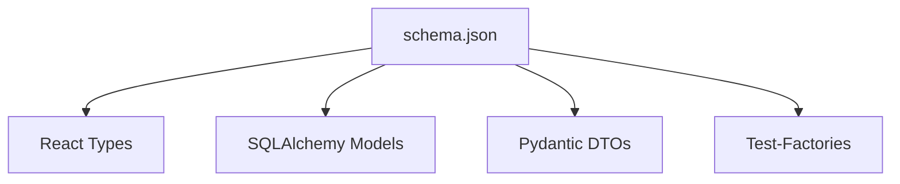

# SAD.md – System Architecture Document

> Dieses Dokument beschreibt die Systemarchitektur des Self-Updating Development Stack. Es dient als technische Hauptreferenz für Claude oder andere LLMs, um MVPs automatisiert zu entwickeln, zu erweitern und stabil in die Produktion zu überführen. Alle hier definierten Standards, Pfade und Routinen sind verbindlich.

---

## 🔍 1. Ziel & Geltungsbereich

- Automatisiertes, reflektierendes Entwicklungssystem für Backend + Frontend (Fullstack)
- Zero-Mock, zero-CI, realitätsnah, mit 100% Test-Coverage und Live-Schemabindung
- Kein Dev/Staging/Prod-Split – nur MVP → Live

---

## 🔹 2. Konfigurations-Kaskade

Alle Laufzeitwerte (DB-URL, Ports, Flags, API-Keys) werden über einen flexiblen Settings-Layer geladen:

1. **ENV** (Runtime-Override)
2. **config.yaml** (Default-Konfig)
3. **DB-basierte Konfiguration (optional)** über Tabelle `app_config`

❌ **Keine Fallback-Werte** – alle Parameter müssen explizit gesetzt sein. Wenn Werte fehlen, ist die Ausführung abzubrechen.

```python
from pydantic import BaseSettings, ValidationError

class Settings(BaseSettings):
    db_url: str
    api_key: str
    class Config:
        env_prefix = ""
        env_file = ".env"

try:
    settings = Settings()  # validiert Pflichtwerte
except ValidationError as e:
    raise SystemExit(f"Konfiguration unvollständig: {e}")
```

**Claude-Regel:** Greife niemals direkt auf ENV oder Secrets zu – immer über `settings` oder `load_secret()`.

---

## 🔹 3. Schema-Snapshot-Service

- `` erzeugt `schema/schema.json` aus echter DB nach Migrationslauf
- Dieses JSON Schema ist die *einzige* Quelle für:
  - Typ-Generierung (TS/React)
  - ORM-Modelle (SQLAlchemy)
  - DTOs (Pydantic)
  - Test-Factories (factory_boy)

**Claude-Regel:** Nutze `schema.json` für alle UI-, Daten- oder Testcode-Erzeugung. Niemals das Live-Schema direkt für Generatoren verwenden.

---

## 🔹 4. Code-Generierung & Artefaktpflege



- Pfade:
  - Frontend: `/frontend/types/*.ts`
  - Backend: `/models/*.py`, `/schemas/*.py`
  - Tests: `/tests/fixtures/*.py`

**Claude-Regel:** Regeneriere Artefakte nach Schemaänderung über `./sync-project.sh`. Commits ohne aktuelle Artefakte sind zu verweigern.

---

## 🔹 5. Runtime-Reflection-Hilfen

```python
cols = get_live_schema("invoice")
```

- Verwendbar für dynamische UI-Generierung, Tabellenvalidierung oder Test-Autovervollständigung
- Greift niemals für Generatorlogik ein, sondern nur zur Laufzeit oder Debug-Zwecken

---

## 🔹 6. Dynamic Fixtures

- `factory_boy` + Reflection = 100 % Schema-konforme Testdaten
- Keine Hardcoded-Felder; Pflichtfelder werden dynamisch ausgelesen und mit Defaults belegt

```python
class InvoiceFactory(SQLAlchemyModelFactory):
    class Meta:
        model = Invoice
    class Params:
        schema = get_live_schema("invoice")
```

**Claude-Regel:** Verwende Factories statt manueller Dummy-Objekte.

---

## 🔹 7. Sync-Prozess & Change Detection

```bash
./tools/scripts/sync-project.sh
# Ablauf:
# 1. Python path setup (export PYTHONPATH="${PYTHONPATH}:$(pwd)/src")
# 2. config validation from config/
# 3. src/wincasa/ module imports validation  
# 4. knowledge base update from data/sql/
# 5. documentation update (./tools/scripts/update-docs.sh)
# 6. test execution (./tools/scripts/run-tests.sh)
# 7. system validation tests (tests/pipeline/)
```

- **Git Hook (optional):**
  - `post-merge` oder `pre-commit`: Bei Migrationen → Sync erzwingen

**Claude-Regel:** Kein Commit bei Schema-Drift, unvollständigen Artefakten oder Coverage < 100%.

---

## 🔹 8. Logging & Error Handling

- Standardisiertes JSON-Logging auf allen Ebenen
- Kein `print()`, kein `except: pass`
- Jeder Fehler hat Trace-ID & wird maschinenlesbar geloggt

---

## 🔹 9. Deployment-Strategie MVP → Live

| Umgebung | Quelle für Konfig      | Verhalten                               |
| -------- | ---------------------- | --------------------------------------- |
| **MVP**  | config.yaml + .env     | Lokale Defaults, einfache Rotation      |
| **LIVE** | ENV + app_config (DB) | Umschaltung über `APP_CONFIG_SOURCE=db` |

- Kein Umbau notwendig, nur ENV-Switch + DB-Config-Service optional aktivieren

---

## 🔹 10. Umschalt- und Update-Routinen

### 🔁 `project-switch.sh`

- Umschaltung der Konfigurationsquelle
- Beispiel: `APP_CONFIG_SOURCE=yaml|env|db`
- Wird automatisch in `.env` oder Deployment-Umgebung gesetzt

### 🛠️ `tools/scripts/sync-project.sh`

- Volle Synchronisationsroutine für WINCASA Package Structure:
  1. Python Path Setup (`export PYTHONPATH="${PYTHONPATH}:$(pwd)/src"`)
  2. Config Validation (`config/.env`, `config/sql_paths.json`)
  3. Package Import Tests (`src/wincasa/core/`, `src/wincasa/utils/`, etc.)
  4. Knowledge Base Update (`src/wincasa/knowledge/knowledge_extractor.py`)
  5. System Prompt Validation (`src/wincasa/utils/VERSION_*.md`)
  6. Dokumentation Update (`./tools/scripts/update-docs.sh`)
  7. Test Execution (`./tools/scripts/run-tests.sh`)
  8. Pipeline Validation (`tests/pipeline/test_sad_system.py`)
  9. E2E Test Validation (`tests/e2e/test_wincasa_complete_e2e.py`)

### 📚 `tools/scripts/update-docs.sh`

- Zentrale Dokumentations-Pipeline:
  1. Sphinx HTML-Dokumentation generieren (`make html` in docs/)
  2. API-Dokumentation aus src/wincasa/* Docstrings extrahieren
  3. INVENTORY.md mit src/wincasa/* Struktur aktualisieren
  4. ARCHITECTURE.md mit Package-Struktur aktualisieren
  5. TESTING.md mit E2E-Testing-Strategy aktualisieren
  6. CHANGELOG.md mit Session-Updates ergänzen

### 🌐 `tools/scripts/docs-live.sh`

- Live-Dokumentations-Server für Entwicklung:
  1. Startet `sphinx-autobuild` auf http://localhost:8000
  2. Überwacht Änderungen in docs/ und Root-Markdown-Dateien
  3. Automatische Browser-Aktualisierung bei Änderungen
  4. Ignoriert temporäre und Backup-Dateien
  5. Live-Reload für ARCHITECTURE.md, TESTING.md, CLAUDE.md

**Claude-Regel:** Verwende **ausschließlich** diese Skripte für Umschaltung und Rebuild. Niemals manuell eingreifen.

---

## 🚀 Zielverhalten

- 1 Commit → alle Layer synchron (Schema, Code, Tests, UI, Docs)
- Keine Redundanz, keine Drift, keine Überraschungen
- Vollautomatisierbar mit Claude CLI und `/commit`, `/gitpush`, `/review`-Anweisungen
- Sphinx-Dokumentation automatisch aktuell mit jedem Sync-Lauf

---

> Dieses Dokument ist die technische "truth of implementation". Alle Abweichungen sind Claude deutlich mitzuteilen oder zu automatisieren.