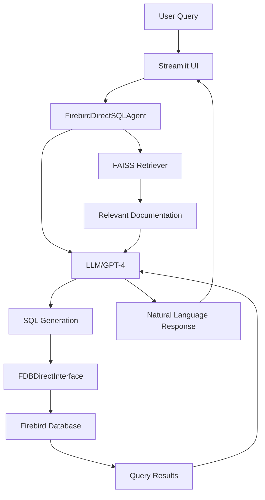

# WINCASA Architecture Documentation

## Overview

WINCASA is a modern database interface system that enables natural language querying of Firebird databases. The system combines traditional database technology with cutting-edge LLM capabilities through a carefully designed architecture that prioritizes reliability and performance.

## Core Architecture Components

### 1. Database Access Layer

#### Direct FDB Interface (Primary)
- **Module**: `fdb_direct_interface.py`
- **Purpose**: Direct database access bypassing SQLAlchemy to avoid lock issues
- **Key Features**:
  - Connection pooling with configurable pool size
  - Automatic server/embedded mode detection
  - Thread-safe operations
  - Proper character encoding handling (WIN1252 to UTF-8)

```python
# Architecture Pattern
FDBDirectInterface
├── Connection Pool (5-10 connections)
├── Query Execution with timeout
├── Schema Information Cache
└── Error Recovery Mechanisms
```

#### Legacy Components (Deprecated)
- `query_router.py` - Original SQLAlchemy-based router (replaced)
- SQLAlchemy connection strings - Still supported for compatibility

### 2. LLM Integration Layer

#### Langchain SQL Agent
- **Module**: `firebird_sql_agent_direct.py`
- **Architecture**:
  ```
  Natural Language Query
  ↓
  FirebirdDirectSQLAgent
  ├── FAISS Retriever (Document Context)
  ├── Custom Langchain Tools
  │   ├── FDBQueryTool
  │   ├── FDBSchemaInfoTool
  │   └── FDBListTablesTool
  └── ReAct Agent (GPT-4)
      ↓
      SQL Query + Natural Language Response
  ```

#### Custom Langchain Tools
1. **FDBQueryTool**: Executes SELECT queries safely
2. **FDBSchemaInfoTool**: Retrieves table/column information
3. **FDBListTablesTool**: Lists available tables

### 3. Retrieval-Augmented Generation (RAG)

#### FAISS Vector Store (Primary)
- **Module**: `retrievers.py`
- **Purpose**: Semantic search over database documentation
- **Implementation**:
  ```python
  Document Loading (YAML/Markdown)
  ↓
  Text Chunking (1500 char limit)
  ↓
  OpenAI Embeddings (text-embedding-3-large)
  ↓
  FAISS Index
  ↓
  Similarity Search (k=10)
  ```

#### Neo4j Graph Store (Experimental)
- **Module**: `neo4j_importer.py`
- **Status**: Implemented but not primary
- **Use Case**: Complex relationship queries

### 4. User Interface Layer

#### Streamlit Applications
1. **Main Application** (`streamlit_integration.py`)
   - Multi-tab interface
   - General purpose database interaction

2. **Enhanced Q&A UI** (`enhanced_qa_ui.py`)
   - Optimized for natural language queries
   - Real-time agent step visualization
   - Performance metrics display

### 5. Supporting Infrastructure

#### Caching & Performance
- **Module**: `db_executor.py`
- **Features**:
  - Query result caching (15-minute TTL)
  - Query timeout enforcement (30 seconds)
  - Result size limiting (1000 rows)

#### Logging & Monitoring
- **Query Logger** (`query_logger.py`): Detailed query tracking
- **Query Memory** (`query_memory.py`): Historical query storage
- **Feedback System**: User satisfaction tracking

## Data Flow Architecture



## Key Design Decisions

### 1. Direct FDB vs SQLAlchemy
- **Problem**: SQLAlchemy causes persistent lock issues (SQLCODE -902) with Firebird Embedded
- **Solution**: Direct FDB interface with custom connection management
- **Trade-off**: Loss of ORM features for improved reliability

### 2. Token Management
- **Challenge**: LLM context window limitations
- **Solution**: Document chunking to 1500 characters
- **Impact**: Maintains quality while preventing token overflow

### 3. Connection Pooling
- **Implementation**: Pre-allocated connection pool (5-10 connections)
- **Benefit**: Reduced connection overhead, better resource management
- **Configuration**: Adjustable based on workload

### 4. Error Handling Strategy
```python
Error Handling Hierarchy:
1. Connection Errors → Retry with backoff
2. Query Errors → User-friendly messages
3. LLM Errors → Fallback responses
4. System Errors → Graceful degradation
```

## Performance Characteristics

Based on benchmarking (see `performance_analysis.md`):

| Operation | Raw FDB | Direct FDB | Overhead |
|-----------|---------|------------|----------|
| Simple Query | 1.50ms | 2.57ms | +1.07ms |
| Schema Info | 0.60ms | 0.17ms | -0.43ms* |
| Count Query | 0.11ms | 0.08ms | -0.03ms |

*Faster due to caching

## Security Architecture

### Query Validation
1. SQL injection prevention through parameterization
2. READ-only operations enforced
3. Dangerous keyword blocking (DROP, DELETE, UPDATE)

### Access Control
- Database credentials in environment variables
- No credential storage in code
- Connection string sanitization in logs

## Deployment Architecture

### Directory Structure
```
langchain_project/
├── Core Modules
│   ├── fdb_direct_interface.py
│   ├── firebird_sql_agent_direct.py
│   └── retrievers.py
├── UI Layer
│   ├── streamlit_integration.py
│   └── enhanced_qa_ui.py
├── Supporting
│   ├── db_executor.py
│   ├── query_logger.py
│   └── query_memory.py
└── Data
    ├── output/
    │   ├── schema/
    │   ├── yamls/
    │   └── cache/
    └── WINCASA2022.FDB
```

### Environment Configuration
```bash
# Required Environment Variables
OPENAI_API_KEY=<key>
FIREBIRD_LIBRARY_PATH=/path/to/libfbclient.so
FIREBIRD_TMP=/path/to/fb_temp

# Optional
OPENROUTER_API_KEY=<key>  # For API routing
```

## Future Architecture Considerations

### Scalability Path
1. **Horizontal Scaling**: Multiple FDB instances with load balancing
2. **Caching Layer**: Redis for distributed cache
3. **Async Operations**: Migration to async/await pattern

### Planned Improvements
1. **Connection Pool Optimization**: Dynamic sizing based on load
2. **Query Plan Caching**: Store successful query patterns
3. **Multi-Model Support**: Additional LLM providers
4. **Monitoring Dashboard**: Real-time performance metrics

## Maintenance Guidelines

### Adding New Features
1. Extend existing interfaces (don't modify)
2. Use dependency injection for new components
3. Maintain backward compatibility
4. Document all architectural changes

### Performance Optimization
1. Monitor connection pool usage
2. Adjust cache TTL based on usage patterns
3. Profile slow queries
4. Regular FAISS index optimization

## Conclusion

The WINCASA architecture successfully balances modern AI capabilities with robust database access patterns. The direct FDB interface provides a reliable foundation, while the modular design allows for future enhancements without disrupting core functionality.