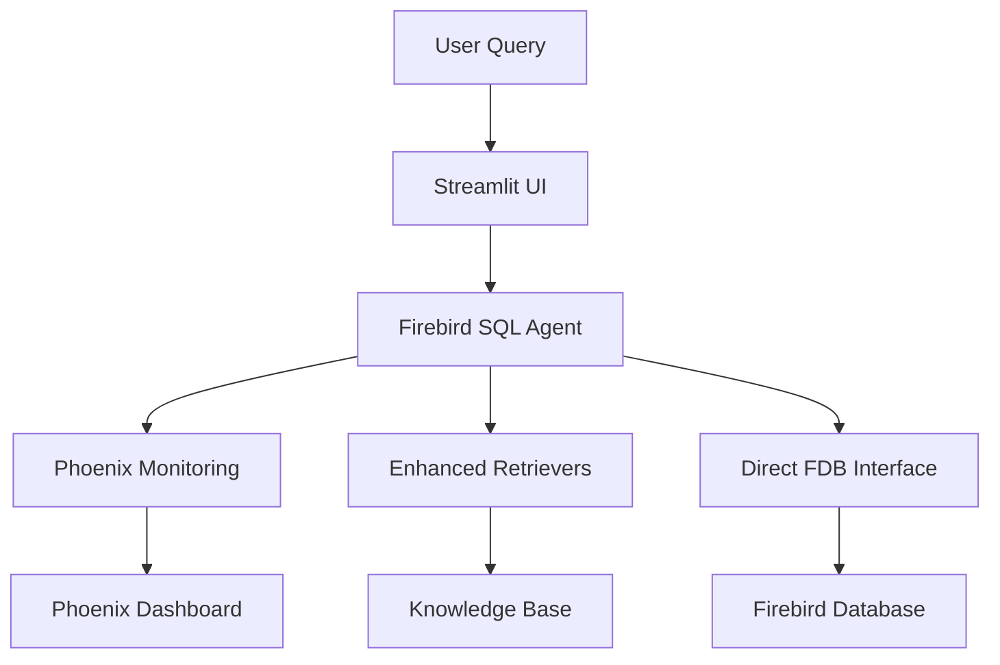

# WINCASA Development Documentation for Claude AI

!!! info "Claude Implementation Guide"
    ✅ **Status: ALL 9/9 MODES OPERATIONAL** - Complete documentation for Claude AI to implement solutions correctly.

## 🎯 Purpose

This documentation provides **clear implementation railways** for Claude AI to build and modify the WINCASA system correctly. WINCASA is a benchmarking system with 9 retrieval modes for determining the best approach for natural language database queries on Firebird databases.

## 🚀 Key Features

### ✅ Core System
- **Direct Firebird Integration**: Optimized database connectivity bypassing SQLAlchemy issues
- **Enhanced Multi-Stage RAG**: Intelligent 3-level document retrieval system
- **Production Web Interface**: Streamlit-based UI for end users
- **Automated Testing**: Comprehensive test suite with 26 unit tests

### ✅ AI Observability (Phoenix Integration)
- **LLM Tracing**: Complete monitoring of all OpenAI API calls with token usage and cost estimation
- **RAG Evaluation**: Performance tracking across Enhanced/FAISS/None modes  
- **Query Analytics**: End-to-end query execution metrics
- **Phoenix Dashboard**: Interactive monitoring at [http://localhost:6006](http://localhost:6006)
- **Cost Management**: Automatic cost calculation for all LLM operations

### 📊 System Metrics
- **Database**: 151 tables, 517 apartments, 698 residents
- **Knowledge Base**: 248 YAML files with business context
- **Performance**: Enhanced Mode 22.5s avg, 63.6% success rate
- **Monitoring**: Real-time Phoenix dashboard integration

## 🎮 Quick Start

### Production Interface
```bash
# 1. Setup environment
python3 -m venv .venv
source .venv/bin/activate

# 2. Install dependencies
pip install langchain langchain-community langchain-openai streamlit pandas numpy \
            scikit-learn fdb faiss-cpu tiktoken PyYAML python-dotenv arize-phoenix

# 3. Configure API keys
echo "OPENAI_API_KEY=your_api_key_here" > /home/envs/openai.env

# 4. Start system
./start_enhanced_qa_direct.sh
```

**URLs:**
- **Main Interface**: [http://localhost:8501](http://localhost:8501)
- **Phoenix Monitoring**: [http://localhost:6006](http://localhost:6006)

## 💬 Example Queries

Try these natural language queries:

- *"Wer wohnt in der Marienstraße 26, 45307 Essen?"*
- *"Wie viele Wohnungen gibt es insgesamt?"*
- *"Zeige mir Bewohner mit ihren Adressdaten"*
- *"Welche Eigentümer gibt es in Köln?"*

## 📊 Performance Overview

| Retrieval Mode | Success Rate | Avg Time | Phoenix Tracking |
|---------------|-------------|----------|------------------|
| **Enhanced** | 63.6% (7/11) | 22.5s | ✅ Full monitoring |
| **FAISS** | 63.6% (7/11) | 34.6s | ✅ Full monitoring |
| **None** | 63.6% (7/11) | 20.8s | ✅ Full monitoring |

## 🏗️ Architecture

The system consists of several key components:



## 🔧 System Requirements

- **Python 3.8+**
- **Firebird Database** (WINCASA2022.FDB)
- **OpenAI API Key**
- **4GB+ RAM** (recommended)
- **Phoenix Monitoring**: Optional but recommended for production

## 📁 Data Organization

- **`/output/yamls/`**: 248 YAML business context files
- **`/output/compiled_knowledge_base.json`**: Compiled knowledge base
- **`/home/envs/`**: API configuration files
- **`/logs/`**: System and Phoenix monitoring logs

## 🎯 Use Cases

### Property Management
- Tenant and owner information queries
- Property details and specifications
- Financial data and rent information
- Maintenance and service records

### Business Intelligence
- Occupancy statistics and analytics
- Revenue and cost analysis
- Tenant demographics and trends
- Property performance metrics

## 📚 Documentation Structure

- **[Getting Started](getting-started/quick-start.md)**: Installation and basic setup
- **[User Guide](user-guide/web-interface.md)**: Using the system interfaces
- **[Technical Documentation](technical/architecture.md)**: Architecture and integration details
- **[Development](development/implementation-status.md)**: Development status and testing
- **[Deployment](deployment/production.md)**: Production deployment guides

## 🔍 Phoenix AI Observability

The integrated Phoenix monitoring provides:

- **Real-time Dashboards**: Complete visibility into system performance
- **Cost Tracking**: Automatic calculation of API usage costs
- **Performance Analytics**: Detailed metrics for all system components
- **Error Monitoring**: Proactive issue detection and alerting
- **Trace Analysis**: End-to-end request tracing

[Learn more about Phoenix Integration →](technical/phoenix-monitoring.md)

## 🧪 Development Standards

- **100% Test Coverage**: For all new features
- **Phoenix Monitoring**: Integrated into all components
- **Conventional Commits**: Structured commit messages
- **Documentation**: Updated with every code change

## ⚡ Next Steps

1. **[Install the system](getting-started/installation.md)** following our detailed guide
2. **[Configure your database](getting-started/configuration.md)** and API keys
3. **[Explore the web interface](user-guide/web-interface.md)** and try example queries
4. **[Set up Phoenix monitoring](technical/phoenix-monitoring.md)** for production observability
5. **[Deploy to production](deployment/production.md)** using our deployment guides

---

**🎉 Ready to get started?** Check out our [Quick Start Guide](getting-started/quick-start.md) or jump directly into the [Installation Instructions](getting-started/installation.md).